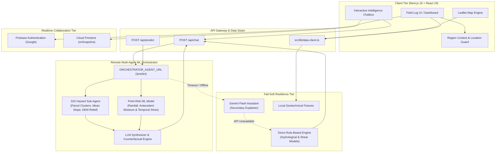
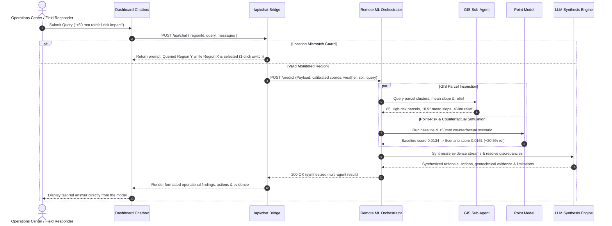

# DistraAI

**Disaster intelligence before the crisis hits.**

DistraAI is a prototype dashboard for monitoring flood and landslide risk across Indian regions. It combines environmental signals — rainfall intensity, soil saturation, slope stability — into a single 0–100 risk score per zone, and presents the result through an interactive map, severity-tiered alerts, community ground reports, and a live responder chat room.

Built with **Next.js 16** (App Router), **React 19**, **TypeScript**, **Tailwind CSS v4**, and **Leaflet**. The live chat at `/chat` is backed by **Firebase** (Authentication + Cloud Firestore); everything else runs on bundled sample data with a clean seam for plugging in a real backend.

---

## Table of Contents

- [Getting Started](#getting-started)
- [Features](#features)
- [Pages & Routes](#pages--routes)
- [Tech Stack](#tech-stack)
- [Architecture & System Flow](#architecture--system-flow)
- [Multi-Agent ML Orchestrator](#multi-agent-ml-orchestrator)
- [Risk Scoring Engine](#risk-scoring-engine)
- [Live Chat & Firebase](#live-chat--firebase)
- [Design Language](#design-language)
- [Map](#map)
- [Environment Variables](#environment-variables)
- [Scripts](#scripts)
- [Testing](#testing)
- [Documentation](#documentation)
- [Known Limitations](#known-limitations)
- [WSL / Windows Notes](#wsl--windows-notes)
- [License](#license)

---

## Getting Started

```bash
# 1. Install dependencies
npm install

# 2. Start the dev server
npm run dev
```

Open [http://localhost:3000](http://localhost:3000). The entire dashboard works immediately with no configuration — risk data comes from bundled sample fixtures.

**To enable live chat** (optional):

```bash
# 1. Create a Firebase project with Google sign-in + Cloud Firestore enabled
# 2. Copy the config template and fill in your values
cp .env.example .env.local

# 3. Deploy the security rules
firebase deploy --only firestore:rules

# 4. Restart the dev server (env vars are inlined at build time)
npm run dev
```

If you skip this, the chat page shows setup instructions instead of a broken sign-in button. The rest of the dashboard is completely unaffected.

---

## Features

| Feature | Description |
| --- | --- |
| **Risk scoring** | Rule-based 0–100 scoring engine combining rainfall, soil moisture, and slope stability into `low` / `moderate` / `high` / `critical` levels |
| **Interactive map** | Leaflet map with GeoJSON risk zone overlays, colour-coded by severity, with layer toggling (flood / landslide / combined) |
| **Alert feed** | Severity-tiered alerts filterable by risk level, styled with colour bars |
| **Sensor insights** | Sparkline cards for rainfall, soil saturation, river level, and satellite change detection |
| **Community reports** | Geotagged ground reports from community observers, typed as reports / updates / questions |
| **Live chat** | Real-time responder chat room backed by Firebase — Google sign-in, Firestore persistence, snapshot listener |
| **Region switching** | Dropdown to switch between 13 monitored regions (Kerala state + 8 districts, Mumbai Metro, Uttarakhand, Assam) |
| **Data provider seam** | `mock` / `api` toggle — swap from bundled fixtures to route handlers (and later a real database) without touching components |

---

## Pages & Routes

| Route | Description |
| --- | --- |
| `/` | Main risk dashboard with gauge, insights, alerts, map, community preview |
| `/map` | Full-screen interactive risk map |
| `/alerts` | Full alert feed with filtering |
| `/community` | Community ground reports |
| `/reports` | Zone-by-zone risk reports |
| `/chat` | Real-time responder chat (Firebase-backed) |
| `/api/*` | Route handlers for alerts, zones, insights, community, regions, risk-summary, reports |

---

## Tech Stack

| Layer | Technology |
| --- | --- |
| Framework | [Next.js 16](https://nextjs.org/) (App Router, Turbopack) |
| UI | [React 19](https://react.dev/) |
| Language | [TypeScript 5](https://www.typescriptlang.org/) |
| Styling | [Tailwind CSS v4](https://tailwindcss.com/) (`@theme` tokens, `@import "tailwindcss"`) |
| Maps | [Leaflet](https://leafletjs.com/) + [React Leaflet](https://react-leaflet.js.org/) |
| Realtime | [Firebase 12](https://firebase.google.com/) (Auth + Firestore) |
| Testing | [Vitest](https://vitest.dev/) |
| Linting | [ESLint 9](https://eslint.org/) (flat config) |
| Docs | [TypeDoc](https://typedoc.org/) + typedoc-plugin-markdown |
| Quality gates | `npm run lint` → `npm run typecheck` → `npm run test` → `npm run build` |

---

## Architecture & System Flow

DistraAI couples a responsive spatial intelligence interface with a hybrid multi-agent backend architecture designed for resilience in low-connectivity or high-latency disaster scenarios.

### 1. High-Level System Architecture



---

### 2. Multi-Agent Reasoning & Query Flow

When a responder or operations center submits a question (e.g., *"if the rainfall increases by 50 mm, how does the risk change?"* or asks for evacuation advisories), the query flows through the following pipeline:



---

### 3. Directory Layout

```
src/
├── app/                    # Next.js App Router
│   ├── page.tsx            # Landing page
│   ├── dashboard/          # Main risk dashboard
│   ├── map/                # Full-screen map view
│   ├── alerts/             # Alerts feed
│   ├── community/          # Community reports
│   ├── reports/            # Zone reports
│   ├── chat/               # Live chat (Firebase)
│   ├── api/
│   │   ├── chat/           # Assistant endpoint connecting to Orchestrator Bridge
│   │   ├── predict/        # Direct ML Predictor gateway
│   │   └── ...             # Route handlers (alerts, zones, insights)
│   ├── globals.css         # Design tokens, utilities, animations
│   └── layout.tsx          # Root layout (fonts, AuthProvider)
│
├── components/
│   ├── alerts/             # AlertFeed, AlertCard
│   ├── chat/               # ChatRoom (sign-in, messages, composer)
│   ├── community/          # CommunityPreview, MessageCard
│   ├── insights/           # InsightCard, sparklines
│   ├── layout/             # TopNav, Footer, RegionPicker
│   ├── map/                # RiskMap, LayerToggle, MapLegend
│   └── risk/               # RiskGauge, RiskSummaryPanel
│
├── data/
│   ├── types.ts            # Shared domain types (the contract)
│   ├── regions.ts          # Monitored Indian regions & bounding centroids
│   └── mock*.ts            # Sample fixtures (alerts, zones, insights, community)
│
├── lib/
│   ├── agents/
│   │   ├── orchestrator-bridge.ts  # Primary remote Orchestrator dispatcher & formatter
│   │   ├── places.ts               # Place resolution & unselected location guard
│   │   ├── gemini-brain.ts         # Secondary Gemini assistant integration
│   │   └── types.ts                # Agent contracts & steps
│   ├── data-client.ts      # Provider seam (mock ↔ api)
│   ├── mock-store.ts       # Fixture accessors
│   ├── risk-summary.ts     # Rule-based scoring engine
│   ├── risk-colors.ts      # Risk level → colour mapping
│   ├── firebase.ts         # Firebase SDK init (fail-soft)
│   ├── use-chat.ts         # Firestore snapshot hook
│   └── use-data.ts         # Generic async data hook
│
├── state/
│   ├── region-context.tsx  # Region selection (synced to ?region=)
│   └── auth-context.tsx    # Firebase auth (Google sign-in)
│
└── firestore.rules         # Security boundary for chat
```

### 4. Data Paths

The platform establishes three segregated data channels:

1. **Risk Telemetry & Sensor Feeds** (dashboard, map, alerts, community):
   ```
   Component → useData(fetcher) → data-client.ts → mock-store / API routes
   ```
   Components call typed accessors on `data-client.ts`, which dispatches to local fixtures or API routes according to `NEXT_PUBLIC_DATA_PROVIDER`.

2. **Multi-Agent Intelligence & Prediction** (`/api/chat`, `/api/predict`):
   ```
   Chatbox → /api/chat → orchestrator-bridge.ts → Remote Orchestrator (/predict)
   ```
   Live inference queries the remote ML orchestrator. When active, its multi-agent findings (GIS parcels, scenario calculations, operational recommendations) drive chat answers directly.

3. **Realtime Responder Collaboration** (`/chat` only):
   ```
   ChatRoom → useAuth() → useChat(user) → Firestore onSnapshot
   ```
   Uses Firebase Authentication for identity and Firestore's `onSnapshot` for real-time peer messaging without polling.

---

## Multi-Agent ML Orchestrator

The backend intelligence engine is governed by [`src/lib/agents/orchestrator-bridge.ts`](src/lib/agents/orchestrator-bridge.ts). It coordinates specialized sub-agents and presents context-specific insights:

- **GIS Hazard Sub-Agent**: Evaluates high-resolution raster and polygon layers, calculating slope inclination angles, digital elevation model (DEM) relief, and identifying high-risk parcels.
- **Geotechnical Point-Risk Model**: Incorporates 24-hour rainfall, cumulative 72-hour totals, 7-day and 30-day antecedent precipitation, volumetric soil moisture (`sm_0_7cm_ante`, `sm_0_7cm_change_3d`), and temporal harmonic features (`doy_sin`, `doy_cos`).
- **LLM Synthesizer & Counterfactual Engine**: Reconciles discrepancies between point-level scores and parcel-level GIS clusters, computes dynamic counterfactual scenarios (e.g. `+50 mm` rainfall surge impact on slope safety factors), and drafts actionable field advisories.
- **Location Verification Guard**: [`src/lib/agents/places.ts`](src/lib/agents/places.ts) verifies whether user queries reference an unselected state/district (e.g. querying *Arunachal Pradesh* while *Assam* is active) and prompts the user to switch with a single click.
- **Spatial Coordinate Calibration**: Maps geographic boundaries to validated study coordinates (e.g. `27.1° N, 93.6° E` for Arunachal Pradesh / Papum Pare) to ensure raster bounding box compatibility.
- **Multi-Tier Resilience**: If the remote orchestrator service times out or is offline, the bridge seamlessly engages a secondary **Gemini Flash** assistant, or the **local rule-based engine**, ensuring zero downtime.

---

## Risk Scoring Engine

The scoring engine lives in [`src/lib/risk-summary.ts`](src/lib/risk-summary.ts). It is **rule-based**, not a machine learning model — every threshold is readable in one file.

Three factors are evaluated:

| Factor | Source | Thresholds |
| --- | --- | --- |
| **Rainfall intensity** | `insights[id=rainfall].value` (mm) | ≥150 critical, ≥100 high, ≥60 moderate |
| **Soil moisture** | `insights[id=soil-saturation].value` (%) | ≥90 critical, ≥80 high, ≥60 moderate |
| **Slope stability** | Any landslide/combined zone at high/critical | Binary: unstable (high) or stable (low) |

The zone scores are averaged, mapped to a level (`low` < 40 ≤ `moderate` < 60 ≤ `high` < 80 ≤ `critical`), and returned as a `RiskSummary` with trend and confidence.

The same engine drives the gauge on the dashboard, the zone fills on the map, and the severity bars on the alert feed. Threshold changes must be accompanied by updates to [`src/lib/__tests__/risk-summary.test.ts`](src/lib/__tests__/risk-summary.test.ts).

See [docs/risk-scoring.md](docs/risk-scoring.md) for the full writeup.

---

## Live Chat & Firebase

`/chat` is backed by Firebase Authentication (Google sign-in) and Cloud Firestore. Messages are written to a `chat_messages` collection and delivered live to all connected users via Firestore's `onSnapshot` listener — no polling.

### Fail-soft design

The Firebase SDK is initialised **defensively**. `getAuth()` throws synchronously when `apiKey` is missing, and because `AuthProvider` is mounted in the root layout, an unguarded throw would crash every route. So when the config is incomplete:

- `firebase.ts` exports `null` for `auth` and `db`
- `AuthProvider` settles immediately in a signed-out state
- `useChat` skips the Firestore subscription
- `/chat` renders setup instructions instead of a broken sign-in button

A fresh clone with no `.env.local` renders the entire dashboard without errors.

### Security

Access control lives in [`firestore.rules`](firestore.rules), not in the client:

- **Auth-gated reads** — only signed-in users can read messages
- **UID matching** — `request.resource.data.uid` must equal `request.auth.uid`
- **Content validation** — text must be a non-empty string ≤1000 chars, with a regex to reject whitespace-only bodies
- **Append-only** — messages cannot be edited or deleted
- **Deny-by-default** — everything not explicitly opened is denied
- **Field whitelist** — only `uid`, `displayName`, `photoURL`, `text`, `createdAt` are allowed

Rules only take effect once deployed (`firebase deploy --only firestore:rules`). See [docs/realtime.md](docs/realtime.md) for the full walkthrough.

---

## Design Language

The interface follows a warm editorial "field log" aesthetic — calm, readable, and purpose-built for high-stakes information.

| Element | Choice |
| --- | --- |
| **Canvas** | Parchment (`#f9f5ec`) with ink text (`#26211b`) |
| **Accent** | Single terracotta (`#b05a36`) — no gradients, no glassmorphism, no glow |
| **Display type** | Fraunces (variable serif) for headlines and scores |
| **Body type** | Karla for all running text |
| **Data type** | JetBrains Mono for numbers, IDs, timestamps, coordinates |
| **Risk colours** | Moss (low), ochre (moderate), burnt orange (high), deep red (critical) |
| **Icons** | Inline SVG with `stroke="currentColor"` and `aria-hidden="true"` — no emoji |
| **Motion** | `animate-fade-in`, `animate-slide-up`, `animate-clip-reveal` with staggered delays; all respect `prefers-reduced-motion` |

Every colour, typeface, spacing token, and utility class lives in [`src/app/globals.css`](src/app/globals.css). See [docs/design-system.md](docs/design-system.md) for the full token reference.

---

## Map

A Leaflet canvas with the standard **OpenStreetMap** basemap (with required attribution). Risk zones are rendered as GeoJSON polygons, tinted by risk level using colours from [`src/lib/risk-colors.ts`](src/lib/risk-colors.ts).

- **Layer toggle** — switch between flood, landslide, and combined overlays
- **Click to inspect** — popups show zone name, risk level, score, and description
- **Region recentering** — the map pans smoothly when switching regions
- **Client-only rendering** — Leaflet components are loaded with `next/dynamic({ ssr: false })`

> **Note**: The public OSM tile server is fine for development and demos but not for production traffic. See the [tile usage policy](https://operations.osmfoundation.org/policies/tiles/) and switch to a hosted provider if deploying.

---

## Environment Variables

Client-exposed variables are prefixed with `NEXT_PUBLIC_` and inlined into the client bundle at build time. Server-side secrets (`ORCHESTRATOR_*`, `GEMINI_*`) remain strictly in the Next.js runtime environment. Restart the dev server after editing `.env.local`.

| Variable | Required | Default | Purpose |
| --- | --- | --- | --- |
| `NEXT_PUBLIC_DATA_PROVIDER` | No | `mock` | `mock` reads local fixtures; `api` fetches from `/api/*` route handlers |
| `ORCHESTRATOR_AGENT_URL` | For live ML | `http://127.0.0.1:8080/predict` | Endpoint URL for the remote multi-agent ML orchestrator service |
| `ORCHESTRATOR_TIMEOUT_MS` | No | `60000` | Request timeout window in ms for multi-agent synthesis & GIS analysis |
| `ORCHESTRATOR_API_KEY` | Optional | — | Bearer authentication token for secured orchestrator endpoints |
| `GEMINI_API_KEY` | Optional | — | Google Gemini API key for secondary conversational assistant |
| `GEMINI_MODEL` | No | `gemini-3.8-flash` | Gemini model version (`gemini-3.8-flash`, `gemini-2.0-flash`) |
| `NEXT_PUBLIC_FIREBASE_API_KEY` | For `/chat` | — | Firebase web app configuration |
| `NEXT_PUBLIC_FIREBASE_AUTH_DOMAIN` | For `/chat` | — | Firebase web app configuration |
| `NEXT_PUBLIC_FIREBASE_PROJECT_ID` | For `/chat` | — | Firebase web app configuration |
| `NEXT_PUBLIC_FIREBASE_STORAGE_BUCKET` | For `/chat` | — | Firebase web app configuration |
| `NEXT_PUBLIC_FIREBASE_MESSAGING_SENDER_ID` | For `/chat` | — | Firebase web app configuration |
| `NEXT_PUBLIC_FIREBASE_APP_ID` | For `/chat` | — | Firebase web app configuration |
| `NEXT_PUBLIC_FIREBASE_MEASUREMENT_ID` | No | — | Optional analytics measurement ID |

See [`.env.example`](.env.example) for the template with explanatory comments. The Firebase web config is public by design — security comes from `firestore.rules`, not from hiding the config.

---

## Scripts

| Command | Description |
| --- | --- |
| `npm run dev` | Start the Next.js dev server |
| `npm run build` | Production build (Turbopack) |
| `npm run start` | Serve the production build |
| `npm run lint` | Run ESLint (flat config) |
| `npm run typecheck` | Run `tsc --noEmit` |
| `npm run test` | Run Vitest unit tests |
| `npm run docs:components` | Regenerate component API docs into `docs/components/` |

---

## Testing

Tests use **Vitest** and live in `__tests__/` directories next to the code they cover:

- [`src/lib/__tests__/`](src/lib/__tests__/) — risk scoring engine, chat message transforms
- [`src/components/insights/__tests__/`](src/components/insights/__tests__/) — insight card rendering

Vitest runs in the `node` environment (no jsdom), so realtime logic is factored into pure, SDK-free modules that can be tested without browser APIs. For example, the Firestore document → `ChatMessage` transform lives in [`src/lib/chat-messages.ts`](src/lib/chat-messages.ts) specifically so it can be unit tested.

```bash
# Run the full quality gate
npm run lint
npm run typecheck
npm run test
```

Run all four before submitting changes to verify nothing is broken.

---

## Documentation

The `docs/` directory contains detailed guides:

| Document | Covers |
| --- | --- |
| [docs/design-system.md](docs/design-system.md) | Colour tokens, typography, utility classes, component recipes |
| [docs/architecture.md](docs/architecture.md) | Data flow, state management, routing, folder structure |
| [docs/data-layer.md](docs/data-layer.md) | `mock` vs `api` providers, adding regions, the provider seam |
| [docs/realtime.md](docs/realtime.md) | Firebase auth, Firestore chat, security rules, extending the realtime path |
| [docs/risk-scoring.md](docs/risk-scoring.md) | Scoring engine, factors, thresholds, calibration |
| [docs/components.md](docs/components.md) | Auto-generated API reference for all exported components |
| [docs/contributing.md](docs/contributing.md) | How to work in this repo — code style, commit conventions, PR process |

---

## Known Limitations

- **Sample data for most features.** Nine Kerala districts carry mock zones and alerts; the remaining regions show honest empty states. All API route handlers serve the same fixtures. Chat is the single feature backed by a real database.
- **Heuristic scoring.** Risk scores are rule-based and calibrated for demonstration, not validated forecasting. The UI makes this explicit ("model estimates for planning and training only").
- **Single chat room.** One global channel with a 120-message window. No per-region rooms, no moderation, no rate limiting, no typing indicators. See [docs/realtime.md](docs/realtime.md#known-limitations) for the roadmap.
- **No offline support.** The dashboard requires a network connection. Firestore's offline persistence is not configured.
- **Security rules are manual.** `firestore.rules` only takes effect once deployed with the Firebase CLI; `next dev` does not enforce them locally. Use `firebase emulators:exec` for local rule testing.

---

## WSL / Windows Notes

If you're developing on a Windows drive mount (`/mnt/c`):

- **`next build`** — Turbopack and Node's `copyFile` cannot write to drvfs mounts. Set `NEXT_DIST_DIR` to a Linux path:
  ```bash
  NEXT_DIST_DIR=/tmp/distraai next build
  ```
  `next.config.ts` reads this variable when set.

- **`npm install`** — Installing new packages may fail with `EPERM` on chmod of bin files. Install tooling on a non-drvfs location if needed.

For production builds, use Linux natively.
