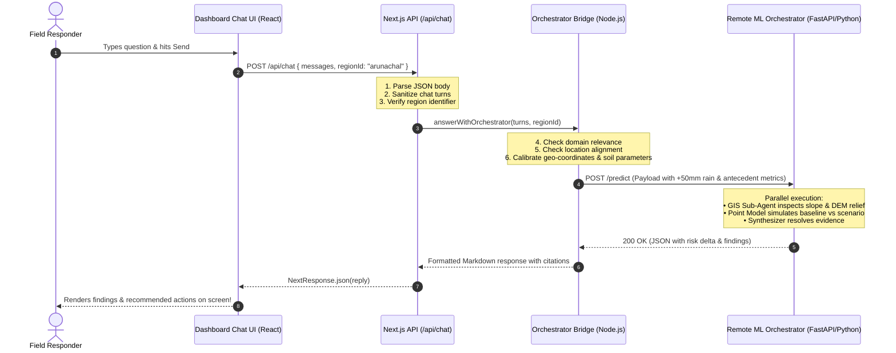

# API Routing in DistraAI — A Beginner's Guide

This document explains how **API Routing** works in DistraAI in plain, beginner-friendly language. 

Whether you are new to Next.js, web development, or machine learning integration, this guide walks through how information travels between what you see on the screen (the frontend) and the intelligence engines running on the server (the backend).

---

## 🍽️ The Real-World Analogy: The Restaurant

If you've ever eaten at a restaurant, you already understand how API routing works!

```text
┌─────────────────┐         ┌──────────────────────┐         ┌─────────────────────────┐
│   THE CUSTOMER  │         │      THE WAITER      │         │       THE KITCHEN       │
│  (Your Browser) │ ──────> │   (Next.js API Route)│ ──────> │ (Remote ML Orchestrator)│
│                 │ <────── │     /api/chat        │ <────── │  FastAPI / Python Models│
└─────────────────┘         └──────────────────────┘         └─────────────────────────┘
```

1. **The Customer (The Frontend / React UI)**:
   - You sit at a table looking at the menu. You type a message: *"If the rainfall increases by 50 mm, how does the risk change?"*
   - As a customer, you don't walk into the kitchen yourself — you tell the waiter what you want.

2. **The Waiter (The API Route — `/api/chat`)**:
   - The waiter takes your request on an order pad.
   - The waiter checks that your request is valid (e.g., checks that you selected a valid monitored region).
   - The waiter carries the order into the kitchen.

3. **The Kitchen & Chefs (The ML Orchestrator & Database)**:
   - The chefs calculate physical slope angles, compute soil moisture saturation, and run mathematical scenario models.
   - When the food is cooked and plated, they hand it back to the waiter.

4. **Serving the Meal**:
   - The waiter brings the finished dish back to your table and serves it cleanly on your plate (the dashboard chatbox renders the formatted response).

---

## 📁 How Next.js File-Based API Routing Works

In Next.js 16 (App Router), you don't need complex server configuration files to define API URLs. **Your folders on your hard drive automatically determine your API URLs.**

Whenever Next.js sees a file named `route.ts` inside `src/app/api/`, it treats that folder as a public web endpoint:

```text
src/app/api/
├── chat/
│   └── route.ts       ──> Accessible at:  http://localhost:3000/api/chat
├── predict/
│   └── route.ts       ──> Accessible at:  http://localhost:3000/api/predict
├── alerts/
│   └── route.ts       ──> Accessible at:  http://localhost:3000/api/alerts
├── insights/
│   └── route.ts       ──> Accessible at:  http://localhost:3000/api/insights
├── zones/
│   └── route.ts       ──> Accessible at:  http://localhost:3000/api/zones
├── risk-summary/
│   └── route.ts       ──> Accessible at:  http://localhost:3000/api/risk-summary
├── community/
│   └── route.ts       ──> Accessible at:  http://localhost:3000/api/community
├── reports/
│   └── route.ts       ──> Accessible at:  http://localhost:3000/api/reports
└── regions/
    └── route.ts       ──> Accessible at:  http://localhost:3000/api/regions
```

### HTTP Verbs: GET vs. POST

Every API endpoint responds to specific actions known as HTTP methods:
- **`GET`**: Used when you want to **read** or **fetch** information without sending a big payload (e.g., *"give me the latest alert feed"*).
- **`POST`**: Used when you want to **submit** data to the server (e.g., *"here is my user question and current coordinates; calculate the risk for me"*).

In Next.js, handling an HTTP method is as simple as exporting a function with that exact name:
```typescript
// Handles HTTP GET requests to this route
export async function GET(request: NextRequest) {
  return NextResponse.json({ message: "Here is your data!" });
}

// Handles HTTP POST requests to this route
export async function POST(request: NextRequest) {
  const body = await request.json();
  return NextResponse.json({ message: "Data received!", received: body });
}
```

---

## 🛡️ Why Have an API Layer? (Why Not Call Python Directly?)

Why can't the React component in `AssistantBot.tsx` just call the Python model server directly?

There are 4 reasons:

### 1. 🔐 Security & Secret API Keys
Browsers run on the user's computer. Anyone can open Chrome DevTools (**F12**) and inspect every network request and piece of client-side code.
- If the browser called external models directly, your secret keys (`ORCHESTRATOR_API_KEY`, `GEMINI_API_KEY`) would be exposed to the public.
- Next.js API routes run safely on your own server. Secrets stay in the server's `.env.local` and are **never transmitted to the browser**.

### 2. 🚦 CORS (Cross-Origin Resource Sharing)
Modern web browsers block web pages from directly calling servers on different domains or ports unless complex CORS headers are allowed. Because Next.js server code runs on the backend, it can call any remote URL (such as an ngrok tunnel or Python FastAPI backend) without CORS restrictions.

### 3. 🛡️ Input Validation & Crash Prevention
If a user submits corrupted inputs, an API route intercepts the request, validates the numbers and strings, and returns an informative `400 Bad Request` rather than letting bad data crash the ML model.

### 4. 🧠 Conversational Guardrails
The API layer executes critical application logic before calling expensive models:
- **Domain Relevance Guard**: Non-disaster queries (e.g. sports, general trivia, coding) are stopped immediately and answered with a pre-recorded guidance message.
- **Location Mismatch Guard**: Asking about an unselected territory (e.g. asking about Mumbai while Arunachal is active) returns a 1-click location switcher.

---

## ⚡ Lifecycle of a Request: Step-by-Step

Here is what happens under the hood when a responder asks:  
> *"If the rainfall increases by 50 mm, how does the risk change?"*



---

## 🔍 Code Walkthrough: `src/app/api/chat/route.ts`

Here is the exact code for the primary assistant route with line-by-line annotations:

```typescript
// 1. Import HTTP primitives from Next.js server runtime
import { NextRequest, NextResponse } from "next/server";
import { GoogleGenAI } from "@google/genai";
import { sanitiseTurns } from "@/lib/agents/chat-service";
import { answerWithOrchestrator } from "@/lib/agents/orchestrator-bridge";
import type { ChatReply } from "@/lib/agents/types";

// 2. Read server-side secret environment variables (hidden from browser)
const apiKey = process.env.GEMINI_API_KEY;
const gemini = apiKey
  ? { client: new GoogleGenAI({ apiKey }).models, model: process.env.GEMINI_MODEL || "gemini-3.8-flash" }
  : null;

// 3. Export the POST function — Next.js invokes this for POST /api/chat
export async function POST(request: NextRequest) {
  let body: { messages?: unknown; regionId?: unknown };
  
  // Step A: Parse the incoming JSON body
  try {
    body = await request.json();
  } catch {
    return NextResponse.json({ error: "Body must be JSON" }, { status: 400 });
  }

  // Step B: Sanitize inputs to prevent malicious injection or oversized payloads
  const turns = sanitiseTurns(body.messages);
  const regionId = typeof body.regionId === "string" ? body.regionId : undefined;

  // Step C: Dispatch to the multi-agent orchestrator bridge
  try {
    const reply: ChatReply = await answerWithOrchestrator(turns, regionId, gemini);
    // Step D: Return the structured reply as JSON with HTTP 200 OK
    return NextResponse.json(reply);
  } catch (error) {
    // Step E: Fail-soft error handling — returns a helpful fallback rather than crashing
    console.error("Chat API error:", error);
    return NextResponse.json(
      {
        reply: "Something went wrong connecting to the Orchestrator service. Please try again.",
        steps: [],
        focusRegionId: null,
        suggestions: [],
        mode: "local",
      } satisfies ChatReply,
      { status: 500 }
    );
  }
}
```

---

## 🗺️ The Complete DistraAI API Catalog

| Endpoint | HTTP Method | Primary Responsibility | Backing Source |
| :--- | :--- | :--- | :--- |
| `/api/chat` | `POST` | Multi-agent reasoning, what-if counterfactuals, and domain guardrails | `orchestrator-bridge.ts` → Remote ML Orchestrator |
| `/api/predict` | `POST` | Geotechnical landslide risk calculator with strict coordinate & soil validation | Server-side validation → ML model gateway |
| `/api/alerts` | `GET` | Delivers severity-ranked emergency warnings (Red / Orange / Yellow) | Local SQLite DB or `mock-store.ts` |
| `/api/insights` | `GET` | Real-time telemetry sparklines (rainfall, river level, soil saturation, satellite) | Sensor telemetry store |
| `/api/zones` | `GET` | GeoJSON polygon boundaries for flood & landslide hazard zones | Leaflet geospatial dataset |
| `/api/risk-summary` | `GET` | Aggregated 0–100 operational risk scores and primary risk drivers | `risk-summary.ts` scoring engine |
| `/api/community` | `GET` | Field reports and ground truth observations logged by local citizens | Community report queue |
| `/api/reports` | `GET` | In-depth zone-by-zone geotechnical assessment cards | District report repository |
| `/api/regions` | `GET` | Directory of monitored Indian states and districts | `src/data/regions.ts` |

---

## 💡 Summary Checklist for Beginners

- **Folder Name = URL**: `src/app/api/foo/route.ts` creates the URL `/api/foo`.
- **Function Name = HTTP Action**: `export async function GET()` handles GET; `export async function POST()` handles POST.
- **Backend = Safety**: API routes run on the server, keeping your passwords and API tokens safe.
- **Guardrails First**: API routes protect heavy ML models from garbage data, unselected regions, and off-topic questions.
